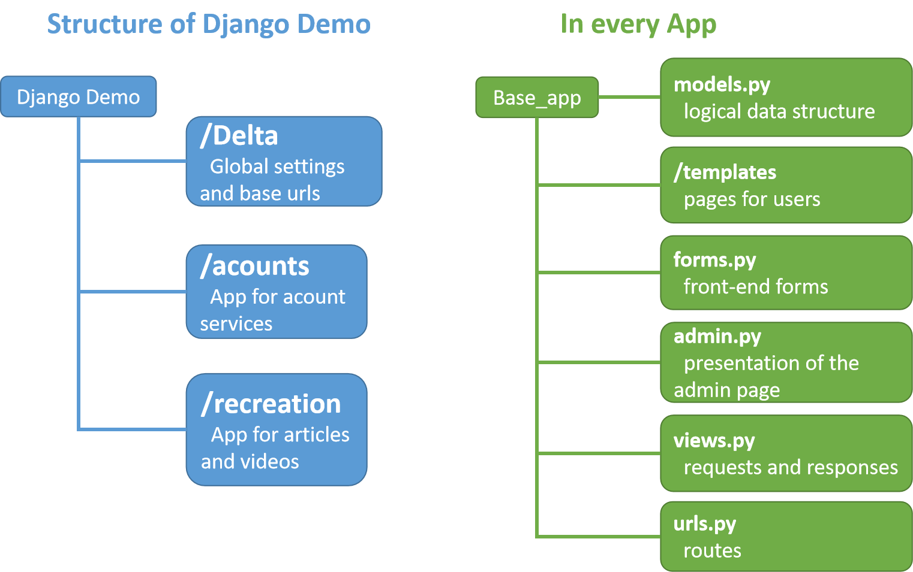

# Django Demo
A simple full-stack Django demo with a basic account service and some CRUD operations.
## Requirements
+ Python -x
+ PyMySQL -x
+ Django -2.2
+ django-simple-captcha -x

**Only Django version is specified** due to django-simple-captcha is used.

Note that you may encounter `'str' object has no attribute 'decode'` error with this version of Django. For a quick fix, you can go to `python/site-packages/django/db/backends/mysql/operations.py`, and modify this function:

```python
	def last_executed_query(self, cursor, sql, params):
    # With MySQLdb, cursor objects have an (undocumented) "_executed"
    # attribute where the exact query sent to the database is saved.
    # See MySQLdb/cursors.py in the source distribution.
    query = getattr(cursor, '_executed', None)
    # if query is not None:
    #   query = query.decode(errors='replace')
    return query
```

## Quick Deployment
1. **copy repository**
 Git clone this repository, and install the necessary libraries mentioned above.
2. **setup database**
 Intall MySQL and create a database for your project. Then go to `Django_demo/Delta/settings.py` and change the `DATABASES` settings.
3. **migrate database**
Open terminal at where manage.py is and run:
 `python manage.py makemigrations`
 `python manage.py migrate`
4. **runserver**
`python manage.py runserver 127.0.0.1:8000`
5. Congrats! Open your browser, now this project should be running at `localhost:8000`

## Project Structure
For Django MTV Architecture, your can learn more in this [page](https://towardsdatascience.com/working-structure-of-django-mtv-architecture-a741c8c64082) from `towardsdatascience.com`.


## Why Django
+ Use **Models** to generate **Forms** of font-end and **Tables** in the database!
+ Database-abstraction API provided by Django can help you to perform CRUD **without SQL statement**！
